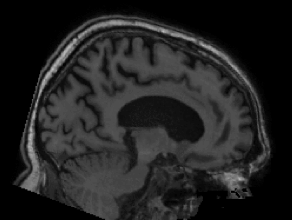
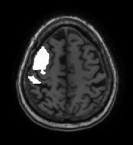
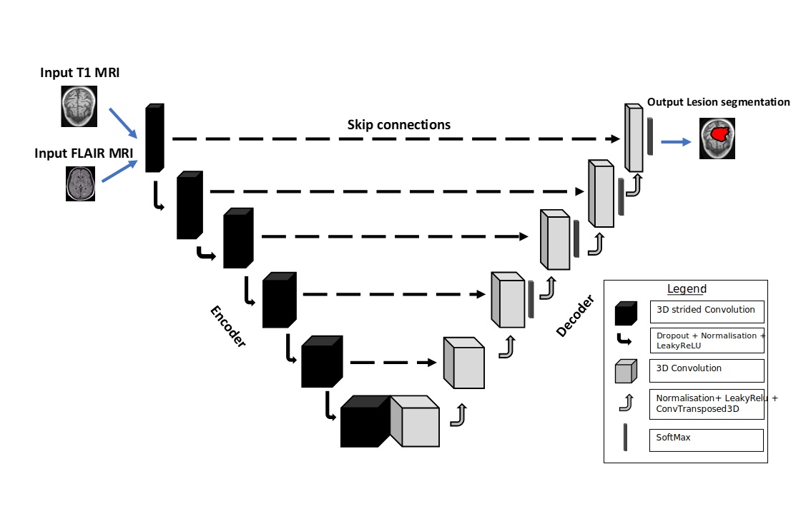

# Deep Learning and Multi-Modal MRI for Segmentation of Sub-Acute and Chronic Stroke Lesions

This repository provides the implementation of the MM-StrokeNet method for segmenting sub-acute and chronic stroke lesions using T1-w and FLAIR MRI modalities.

<!-- 
<p align=center>
  
  
</p>-->

Main contacts : 

Lounès Meddahi lounes.meddahi@ens-rennes.fr  
Francesca Galassi francesca.galassi@irisa.fr

## Overview

This repository contains the code for fine-tuning a pre-trained single-modality nnU-Net model to handle two modalities (T1-w and FLAIR MRIs), as well as the following trained models: the baseline single-modality model trained on the ATLAS v2.0 dataset, the fine-tuned single-modality T1-w model, and the fine-tuned dual-modality T1-w + FLAIR model. Fine-tuning was performed on a private dataset. The entire pipeline, the adaptation process, and the models are described in our paper "Deep Learning and Multi-Modal MRI for Segmentation of Sub-Acute and Chronic Stroke Lesions", currently under review.

<!--
<p align=center>
  
</p>-->

## Methods and Materials

### Datasets

To ensure reproducibility and transparency in our work, we provide detailed descriptions of the datasets used in our study. The datasets include a publicly available single-modality dataset (ATLAS v2.0) and an internal dual-modality dataset (combining T1-w and FLAIR MRI scans). The following sections describe the datasets in detail, including their acquisition, preprocessing, and usage.

#### 1. Public Single-Modality ATLAS v2.0 Dataset

The **ATLAS v2.0 dataset** was used to develop our baseline single-modality model. It consists of T1-weighted (T1-w) MRI scans and lesion segmentation masks. This dataset is publicly available and has been pre-aligned to the **MNI-152 standard template** with a voxel size of **1 x 1 x 1 mm**. 

The dataset includes:
- **Training set:** 655 T1-w MRI scans with corresponding lesion segmentation masks.
- **Test set:** 300 T1-w MRI scans.
- **Hidden test set:** 316 T1-w MRI scans.

**Lesion volumes:** The average lesion volume in this dataset is **3.28 x 10⁴ mm³**, with individual lesion volumes ranging from **13 mm³** to **4.79 x 10⁵ mm³**. This dataset is used for training and validating our baseline model.

#### 2. Internal Dual-Modality Datasets

The **internal dual-modality datasets** were collected from two clinical studies: the **NeuroFB-AVC study** (NCT03766113) and the **AVCPOSTIM study** (NCT01677091). These datasets include both **T1-w** and **FLAIR** MRI modalities and were used to fine-tune the baseline model to work with dual-modality inputs.

**Dataset A** (used for fine-tuning the model) consists of:
- T1-w and FLAIR scans from patients in the **sub-acute** (7 days to 6 months post-stroke) and **chronic** (over 6 months post-stroke) phases.
- The dataset includes patients with both **ischemic** and **hemorrhagic** strokes.

The **NeuroFB-AVC study** was conducted on a **3T Magnetom Siemens Prisma** scanner, while the **AVCPOSTIM study** used multiple scanner types, including:
- **3T Magnetom Siemens Prisma**
- **1.5T Siemens Avento**
- **3T Philips Medical Systems Achieva**
- **3T GE Discovery**

**Manual segmentation** was performed on the FLAIR images with the assistance of T1-w scans by a trained neuroimaging expert, and reviewed by a neuroradiologist.

**Dataset A Details:**
- T1-w images have a mean voxel size of **1 x 1 x 1 mm**.
- FLAIR images have a mean voxel size of **0.75 x 0.75 x 3.3 mm**.

**Dataset B** (used for model testing) contains:
- T1-w images with a mean voxel size of **(0.942 ± 0.158, 0.942 ± 0.158, 1.463 ± 1.286) mm**.
- FLAIR images with a mean voxel size of **(0.680 ± 0.224, 0.680 ± 0.224, 1.286 ± 1.638) mm**.

Both **Dataset A** and **Dataset B** were used to train and evaluate the dual-modality model.

### Data Access

The **ATLAS v2.0 dataset** is publicly available for download from [here](https://fcon_1000.projects.nitrc.org/indi/retro/atlas.html).

For access to the **internal datasets**, please contact the authors or refer to the corresponding clinical study registrations: [NeuroFB-AVC Study (NCT03766113)](https://clinicaltrials.gov/ct2/show/NCT03766113) and [AVCPOSTIM Study (NCT01677091)](https://clinicaltrials.gov/ct2/show/NCT01677091).

### Ethical Considerations

All subjects in the internal datasets provided **written informed consent** prior to participation. The studies were approved by the relevant ethics committees and complied with **French data confidentiality regulations**. 

## Preprocessing Pipeline

The preprocessing pipeline is a critical component in the preparation of MRI data prior to segmentation model training. It ensures that the input images are appropriately aligned, normalized, and corrected for artifacts, thereby improving the reliability and accuracy of subsequent analyses. The following preprocessing steps are applied to the MRI data to enhance image quality and ensure consistency across subjects and modalities:

### Preprocessing Steps

#### 1. **Brain Extraction**
The **HD-BET** tool is used to remove the skull from the images. This deep learning-based method provides improved accuracy for brain extraction compared to traditional methods. For more information on HD-BET, please refer to [the HD-BET repository](https://github.com/MIC-DKFZ/HD-BET).

#### 2. **Re-orientation**
The volumes are re-oriented to the **RAS** (Right-Anterior-Superior) coordinates to ensure consistent orientation across all images. This step is crucial for standardizing image orientation and preventing issues during further processing.

#### 3. **Registration**
If both **T1-weighted** (T1-w) and **FLAIR** images are available for a subject, the T1-w image is rigidly registered to the corresponding FLAIR image using a block matching registration method (**animaPyramidalBMRegistration**, **Anima** (https://anima.irisa.fr/)). If only the T1-w modality is available, this step is skipped. This ensures alignment between T1-w and FLAIR images when both are present, supporting multi-modality analysis.

#### 4. **Bias Correction**
The bias due to spatial inhomogeneity is estimated and removed from the data using the **N4ITK** bias field correction algorithm. This correction compensates for signal variations caused by magnetic field inhomogeneities during MRI acquisition, ensuring more uniform intensity across the image.

#### 5. **Intensity Normalization**
Image intensities are standardized by subtracting the mean voxel value and dividing by the standard deviation for each image. This normalization step ensures that all images have a consistent intensity distribution, making them comparable across subjects and modalities, which is crucial for downstream analyses and model training.

## Installation and Requirements

This section provides a step-by-step guide on how to install and run MM-StrokeNet. Before proceeding, ensure your system meets the following requirements:

### Software Requirements
- Python 3.9 or higher
- Torch 2.0.0 or higher
- Scipy
- NumPy
- scikit-learn
- scikit-image 0.19.3 or higher

### Hardware Used
- NVIDIA GPU (RTX A5000 GPU and 30,6GiB RAM) with CUDA 11.4

### Installation Steps
Clone this repository with the following command:

```bash
git clone https://github.com/LounesMD/MM_StrokeNet.git


## MM-StrokeNet packages
In this repository you will find the following folders :
* Algorithm : Custom scripts used to modify the pretrained nnU-Net model for compatibility with dual-modality (T1-w + FLAIR) inputs.
* Images : Visual assets used in the paper, including images and figures.
* Models : Pretrained and fine-tuned model weights and configurations. This includes:
	*   The baseline model trained on the [ATLAS v2.0 dataset](https://fcon_1000.projects.nitrc.org/indi/retro/atlas.html).
	*   The fine-tuned model on T1-weighted MRIs.
	*   The fine-tuned model on both T1-weighted and FLAIR MRIs.

## Paper :
The original research paper is currently under review. Initial results were presented in the form of an oral presentation at the 13th World Congress for Neurorehabilitation (WCNR) 2024. Here is a [link](https://hal.science/hal-04546362) to the paper's abstract.

## Citing 
If you use this project in your work, please consider citing it as follows:

```bibtex
@misc{MM-STROKEnet,
  authors = {Lounès Meddahi, Stéphanie s Leplaideur, Arthur Masson, Isabelle Bonan, Elise Bannier Francesca Galassi},
  title = {Enhancing stroke lesion detection and segmentation through nnU-net and multi-modal MRI Analysis},
  year = {2024},
  conference = {WCNR 2024 - 13th World Congress for Neurorehabilitation, World federation for Neurorehabilitation},
}
```
