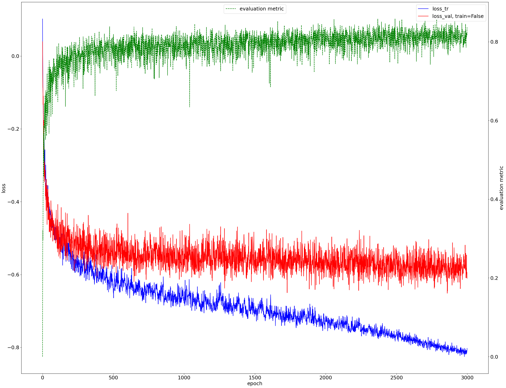
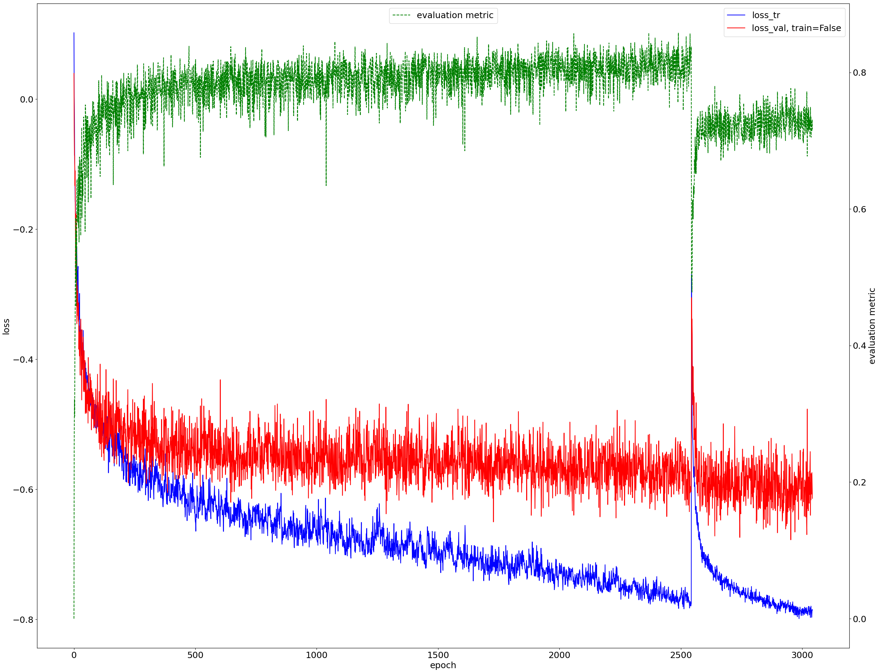

# nnU_Net for Brain Stroke Segmentation
# Overview
This repository contains the code and models (weights) used for brain stroke segmentation using [nnU-Net](https://github.com/MIC-DKFZ/nnUNet)/[Longiseg4MS](https://gitlab.inria.fr/amasson/longiseg4ms). The model was first trained on T1-weighted MRIs from the [ATLAS v2.0 dataset](https://fcon_1000.projects.nitrc.org/indi/retro/atlas.html), and then adjusted using a custom [algorithm](./Algorithm/finetune_Script.py) to make it compatible with T1+FLAIR MRIs. It was then further finetuned using T1-weighted+FLAIR MRIs from our own in-house dataset. The repository also contains the weights and results from [both models](./Weights/).

  
  

